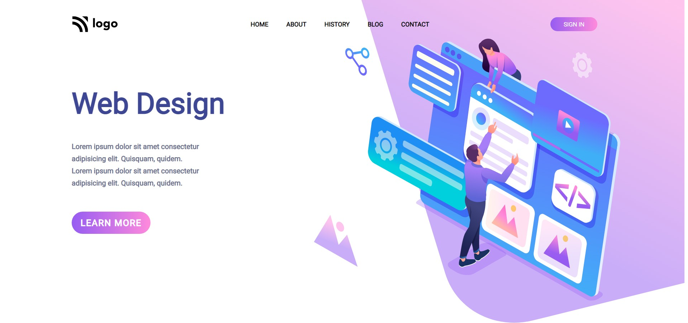

# ⭐ Project 8 : Web Design Landing Page⭐

## 🔗Project 8 Link
https://htmlcssproject08.netlify.app/

This is a assignment given in **"JavaScript Full Stack Web Developer Bootcamp"** by **iNeuron**, built using **HTML5 and CSS3**.
 

 

## 📌 Tech Stack

&nbsp;
&nbsp;
 
 

## 📌 Overview

 

 "Template Screenshot")

## 📌 What I Learn

👉 Flexbox and Grid   
👉 Working with CSS variables  
👉 Concept of z-index   
👉 **CSS Pseudo Selectors**   
👉 Position in CSS   
👉 **Gradient background** and CSS clip generator   
👉 Making element inflow and flow out of the HTML document   
👉 SVG Images   

## Time taken to complete this project was **4 hr**.

## 📬 Connect With Me

- **LinkedIn** - [Pratyush Kesarwani](https://www.linkedin.com/in/pratyush-kesarwani-2b6601171/)

## 📌 Acknowledgments

- Course Instructor - [Hitesh Choudhary](https://github.com/hiteshchoudhary)
